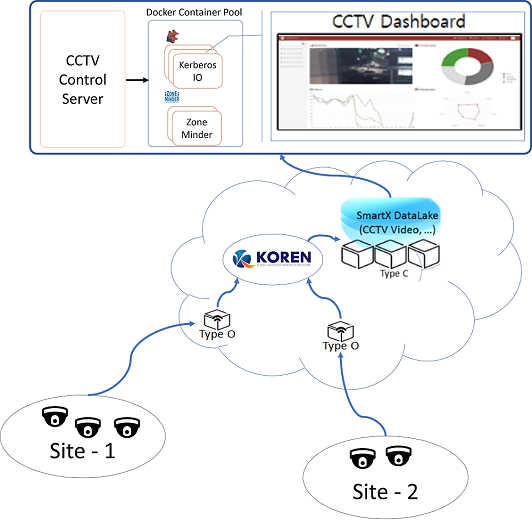
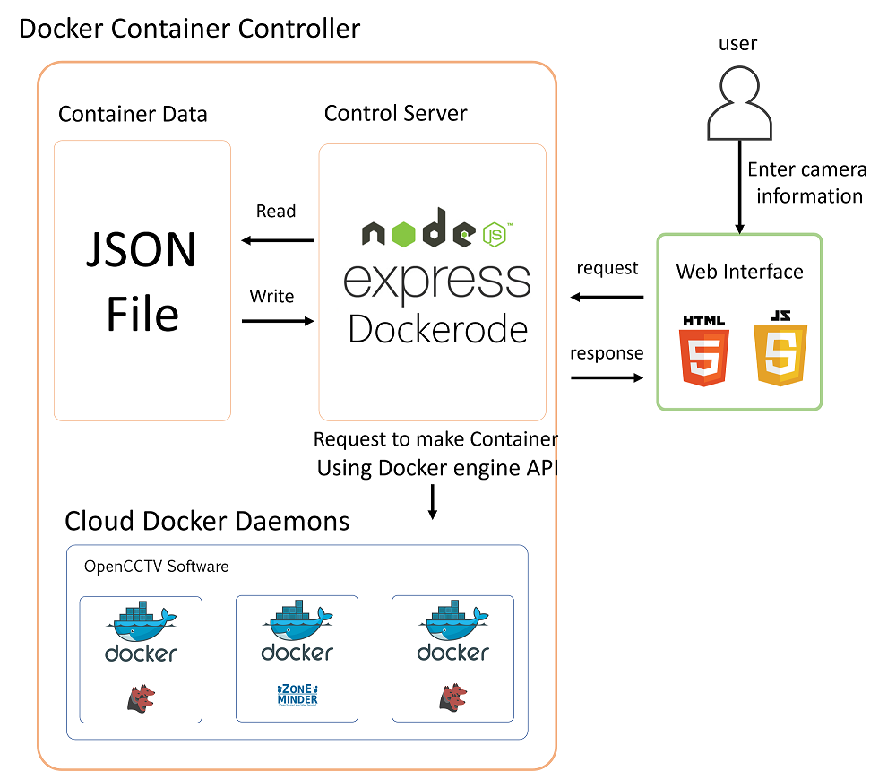

# ControlServer

### ControlServer Architecture



### ControlServer FrameWork



### Explanation

RESTful API을 통하여 추가 하고 싶은 IPcamera를 원하는 컨테이너와 연동하여 ControlServer에서 실행하고 제거 할 수 있습니다.

또한 ControlServer에서 스트리밍 중인 IPCamera의 구성 및 HTTP Proxy Streaming url을 RESTful API 사용하여 알 수 있습니다.

추가된 컨테이너와 모니터의 데이터는 아래와 같은 데이터 형식으로 저장 됩니다.
'Obox' Key에는 현재 추가된 Obox데이터 값들을 배열로 저장합니다.
obox데이터는 'name', 'container'로 이루어 져있고 name은 해당 obox의 이름, container는 실행 중인 컨테이너의 정보를 리턴합니다.
'container'의 값은 'name', 'type', 'webport', "camera" 값을 가지고 있고 각 컨테이너의 이름, openCCTV 어플리케이션 type, 사용중인 webport, 등록된 camera를 가지고 있다.
'camera'값은 배열 형식으로 컨테이너에 연동된 Ipcamera의 정보를 가지고 있다.
```
{
  "Obox": [{
    "name": "JNU",
    "container": [{
      "name": "containerName",
      "type": "container type",
      "webport": "port the container using",
      "camera": [{
          "name": "cameraName",
          "url": "http proxy url"
        }
      ]
    }]
  }]
}
```
### Control Server API

* Overview

위 API는 Container Control Server내에서 실행 되는 컨테이너와 해당 컨테이너가 스트리밍 하는 HTTP Streaming URL을 제공한다. 그리고 컨테이너의 정보는 카메라가 설치된 Obox를 기준으로 저장한다.

* Methods

Control Server API는 각 Obox, Container, Camera의 메타 데이터를 Json파일에 저장하고 관리한다.

** get
요청 기준과 일치하는 0개 이상의 camera리소스 집합을 반환합니다.

** create
카메라 메타 데이터를 업데이트 합니다. 이 메소드는 사용자가 추가한 OpenCCTV Software 도커 컨테이너 정보를 Obox, Container, Camera의 구조로 업데이트 합니다.

** delete
사용자가 선택한 카메라의 스트리밍을 중지하고 카메라 메타 데이터 및 컨테이너 메타 데이터를 삭제한다.

* Return Type

API의 결과는 Json 형식으로 전달 되고 Json 데이터는 'success'와 'result' 두 개의 key 값으로 이루어 집니다.

'success' 데이터는 API의 동작 여부를 확인하는 값으로 요청한 데이터를 찾지 못 하였을 경우 0을 리턴하고 성공적으로 값을 가져 올 경우 1을 뜻합니다.

'result' 데이터는 요청 데이터를 배열 형식으로 값을 저장 하고 있습니다.
